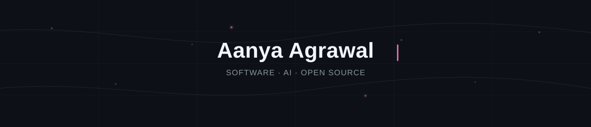

 

Computer Science + Business Information Management @ UC Irvine

Building thoughtful software across full-stack systems, AI, and product.

LinkedIn ·Email ·GitHub

currently

building full-stack + AI systems

contributing to open source

leading CareTech @ UCI

exploring backend, ML, and product

stack

Python Java C++ TypeScript React Node.js PostgreSQL Docker AWS Git

  

building things that are useful, thoughtful, and scalable.

